# Deer Portal - Game Handbook & Card Reference

## Introduction

Deer Portal is a multiplayer board game driven by the four classical elements, designed for 0-4 players. The game takes place in an ancient world where the Almighty Deer God protects all compassionate creatures.

### Game Objective

Transform yourself into a **Deer Lesser God** by reaching the **Hoof Portal** and collecting the most diamonds.

### Game Philosophy

The game was inspired during a Buddhist journey through Japan, specifically after visiting Tōdai-ji temple in Nara. The mission is to spread the word about the Deer through this strategic gameplay.

## Game Setup

### Classical Elements

The gameboard is divided into four areas, each controlled by one classical element:

- **Water** (Blue) - Represents flow, adaptation, and change
- **Earth** (Green) - Represents stability, growth, and foundation
- **Fire** (Red) - Represents energy, transformation, and passion
- **Air** (Yellow) - Represents freedom, intellect, and movement

### Players

Each of the four players is mentored by one classical element and can:

- Move around their designated board area
- Collect runes and diamonds
- Meditate to receive help from their patron element
- Reach the Deer Portal for transformation

Players can be controlled by humans or computers, allowing for various gameplay configurations.

### How to Play

#### Turn Structure
Each active player (who hasn't reached the portal yet, nor is frozen) performs two actions during their turn:

1. **Roll the Dice** - Click on the dice symbol in the bottom right area
2. **Choose Movement** - Click on the corresponding area on your board to move your character

#### Field Effects
After moving your character, depending on the destination field you may:

- **Collect Diamonds** - If there was one on the field (+1 cash)
- **Activate Cards** - If a rune was on the field (execute card effect)
- **Meditate** - If the field was your starting place (regenerate your area)
- **Enter Portal** - Move to the Deer God kingdom (end game trigger)

## Card System

The heart of Deer Portal's strategy lies in its sophisticated card system. Each element maintains a deck of 32 cards that provide powerful interactions between players.

### Card Distribution

| Card Type | Quantity per Element | Total in Game |
|-----------|---------------------|---------------|
| Stop Cards | 8 | 32 |
| Remove Cards | 8 | 32 |
| Diamond Cards | 8 | 32 |
| Diamond x2 Cards | 8 | 32 |
| **Total per Element** | **32** | **128** |

### Card Activation Rules

1. **Own Element Runes**: When landing on your own element's rune, the card is discarded and the next card is revealed
2. **Other Element Runes**: When landing on another element's rune, the card effect executes against that element's area
3. **Targeting Restriction**: You cannot use cards against your own element area
4. **Deck Progression**: After each card use, the deck advances to the next card
5. **Deck Exhaustion**: When a deck runs out, that element pile becomes inactive

## Card Types & Effects

### Stop Cards

**Primary Effect**: Freeze target player for one complete turn

**Strategic Use**:
- Disrupt leading players during critical moments
- Prevent opponents from reaching the portal
- Buy time to collect valuable resources
- Most effective during mid-to-late game phases

**Visual Design**: Each element's stop card features a distinctive yellow prohibition symbol overlaid on the element's thematic background.

| Water Stop | Earth Stop | Fire Stop | Air Stop |
|:----------:|:----------:|:---------:|:--------:|
|  |  | 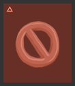 |  |

### Remove Cards

**Primary Effect**: Eliminate a random diamond or card from target element area

**Strategic Use**:
- Reduce opponent resource accumulation
- Eliminate high-value targets before opponents can collect them
- Tactical disruption of opponent strategies
- Most effective when target areas have valuable visible resources

**Visual Design**: Features a crossed-out diamond symbol on each element's themed background, representing resource elimination.

| Water Remove | Earth Remove | Fire Remove | Air Remove |
|:------------:|:------------:|:-----------:|:----------:|
| 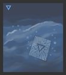 | 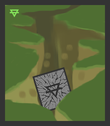 | 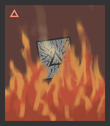 | 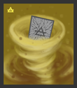 |

### Diamond Cards

**Primary Effect**: Steal one diamond from target area + award 1 cash to current player

**Strategic Use**:
- Direct resource acquisition from opponents
- Build economic advantage throughout the game
- Steady progression toward victory condition
- Effective throughout all game phases

**Visual Design**: Displays a single, prominently featured diamond on each element's background.

| Water Diamond | Earth Diamond | Fire Diamond | Air Diamond |
|:-------------:|:-------------:|:------------:|:-----------:|
| 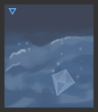 | 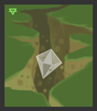 | 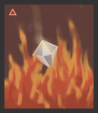 | 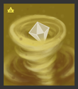 |

### Diamond x2 Cards

**Primary Effect**: Steal two diamonds from target area + award 2 cash to current player

**Strategic Use**:
- Maximum resource gain per single card activation
- Game-changing potential in close matches
- Priority target for strategic timing
- Most valuable card type in the deck

**Visual Design**: Features two diamonds prominently displayed, often with enhanced visual effects representing their increased value.

| Water Diamond x2 | Earth Diamond x2 | Fire Diamond x2 | Air Diamond x2 |
|:----------------:|:----------------:|:---------------:|:--------------:|
| 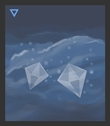 | 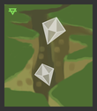 | 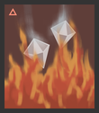 | 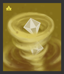 |

## Element-Specific Visual Themes

### Water Element Cards
Visual characteristics include flowing water textures, blue gradients, and aquatic motifs that convey fluidity and adaptability.

### Earth Element Cards
Feature natural textures, green earth tones, and organic patterns representing stability and growth.

### Fire Element Cards
Incorporate flame effects, warm red colors, and dynamic energy patterns symbolizing transformation and passion.

### Air Element Cards
Display light, airy backgrounds with yellow/white color schemes and flowing patterns representing freedom and movement.

## Advanced Strategy

### Card Priority System
1. **Diamond x2 Cards** - Highest strategic value
2. **Diamond Cards** - Reliable resource acquisition
3. **Stop Cards** - Tactical disruption tool
4. **Remove Cards** - Situational utility option

### Timing Strategies
- **Early Game**: Focus on diamond cards for resource building
- **Mid Game**: Deploy stop cards against leading players
- **Late Game**: Use remove cards to eliminate threats before portal entry

### Element Targeting
Consider these factors when choosing targets:
- Visible resource density in target areas
- Strategic position of controlling players
- Current game state and remaining turns
- Deck status of different elements

## Special Game Mechanics

### Meditation System
Returning to your starting position with an exact dice roll triggers meditation, which:
- Regenerates all diamonds and cards in your area
- Requires precise dice roll calculation
- Provides strategic reset opportunity
- Essential for long-term resource management

### Deck Exhaustion Effects
When element decks become empty:
- Deck becomes inactive (no more cards can be drawn)
- All remaining resources of that element are removed from the board
- Element becomes strategically less valuable
- Affects long-term game balance

### Deer Mode
When the first player reaches the portal:
- **Deer Mode** begins (4 rounds - one turn per player)
- First player gets bonus diamonds for reaching first
- All remaining players must reach portal before Deer Mode ends
- Players who don't reach portal in time are eliminated

## Victory Conditions

### Primary Victory
The player with the most diamonds when all players reach the portal (or deer mode ends) wins the game.

### Tiebreaker
In case of diamond count ties, victory goes to the player who reached the portal first.

### Transformation
- **Winner**: Transforms into a Deer God
- **Survivors**: Become devoted monks spreading the philosophy
- **Eliminated**: Become the foundation of the new philosophy
