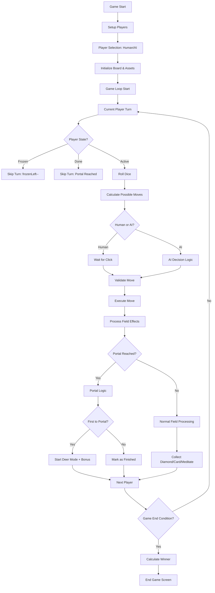

# 🦌 DeerPortal Game Logic Analysis & Implementation

## Overview

DeerPortal is a computer multiplayer board game driven by the four classical elements. This document provides a comprehensive analysis of how the game rules are implemented in the codebase, based on thorough code examination and the official handbook (DeerPortalHandbook.pdf located in assets/pdf/).

## 🎯 Core Game Objective

**Goal**: Transform into a **Deer Lesser God** by reaching the **Hoof Portal** and collecting the most diamonds.

**Victory Conditions**:
1. **Primary**: Player with most diamonds wins
2. **Tiebreaker**: First player to reach portal wins
3. **Transformation**: Winner becomes Deer God, others become monks or heritage

## 🏗️ Game Architecture

### Board Structure
- **Size**: 16×16 grid (256 positions)
- **Tile Size**: 40 pixels each
- **Total Dimensions**: 640×640 pixels
- **Center Position**: (320, 320) - Position 136

```cpp
// Core constants from src/data.h
const static int startPlayers[4] = {0,15,255,240};      // Starting positions
const static int endPlayers[4] = {119,120,135,136};     // Portal exit positions
const static int diamondsNumber = 112;                   // Total diamonds on board
```

### Player System
**Elements & Colors** (from `src/data.cpp`):
- **Water** (Player 0): Blue `sf::Color(122, 185, 246, 255)`
- **Earth** (Player 1): Green `sf::Color(144, 226, 106, 255)`  
- **Fire** (Player 2): Red `sf::Color(255, 163, 142, 255)`
- **Air** (Player 3): Yellow `sf::Color(250, 255, 117, 255)`

### Player Attributes (from `src/playerhud.h`)
Each player has the following complete attribute set:
```cpp
class Player {
    int pos;              // Current board position
    int cash;             // Diamond count (primary victory condition)
    int energy;           // Resource attribute
    int food;             // Resource attribute  
    int faith;            // Resource attribute
    bool active;          // Currently playing
    bool done;            // Reached portal (finished)
    int frozenLeft;       // Turns remaining in freeze state
    bool reachedPortal;   // Has reached any portal exit
    bool reachedPortalFirst; // Was first to reach portal
    bool human;           // Human vs AI controlled
    bool reachPortalMode; // Can access portal (has most diamonds)
};
```

## 🎮 Game Flow



## 🎲 Core Game Mechanics

### 1. Turn System
The game proceeds in turns, with each of the four players taking a turn to form a round. The game uses `launchNextPlayer()` to manage turn succession, automatically skipping players who are frozen or have finished the game.

### 2. Dice System
Player movement is determined by a standard six-sided die roll, implemented in `rounddice.cpp`.

### 3. Movement System
Players move along predefined paths on the board. The number of steps is determined by the dice roll.

### 4. Field Processing System
When a player lands on a tile, the game processes the effects of that tile. This can include collecting diamonds, drawing cards, or meditating. This logic is handled by `command.cpp`.

### 5. Resource Management System
Players compete to collect diamonds. The board starts with 112 diamonds, and players can gain or lose them through various actions.

### 6. Card System
Players can draw cards that provide special actions, such as stealing diamonds from other players, freezing them for a turn, or removing their cards.

### 7. Big Diamond System (Center Bonus)
A special diamond at the center of the board provides a +3 cash bonus. It only becomes visible when a player has the most diamonds, indicating they are eligible to enter the portal.

### 8. Meditation System
If a player lands on their own starting tile with an exact dice roll, they "meditate," which regenerates all the diamonds and cards in their home quadrant.

### 9. Portal & Deer Mode
The first player to reach a portal tile triggers "Deer Mode," a 16-turn countdown to the end of the game. This player also receives a cash bonus.

### 10. Freeze System
The "stop" card allows a player to freeze another player, causing them to miss their next turn.

## 🕹️ Game States

The game's flow is controlled by a state machine defined in `src/game.h`. The `currentState` variable dictates the game's current behavior.

- `state_init`: **Initialization State**. The very first state on game startup. It handles initial setup and immediately transitions to `state_intro_shader`.
- `state_intro_shader`: **Intro Animation**. Plays a full-screen shader animation as a splash screen. Transitions to `state_menu` when finished.
- `state_menu`: **Main Menu**. Displays the main menu, waiting for the user to start a new game. Transitions to `state_setup_players`.
- `state_setup_players`: **Player Configuration**. Allows users to set which players are human-controlled and which are AI. Transitions to `state_lets_begin` on confirmation.
- `state_lets_begin`: **Game Start Transition**. Displays a "Let's Begin!" message that fades out, giving a visual cue that the game is starting. Transitions to `state_roll_dice`.
- `state_roll_dice`: **Dice Roll Phase**. The start of a player's turn. The game waits for the current player to roll the dice (either by click for humans or automatically for AI). Transitions to `state_game`.
- `state_game`: **Main Gameplay Phase**. After the dice roll, the player chooses a valid move. The game then processes the move and its consequences before advancing to the next player (back to `state_roll_dice`).
- `state_gui_end_round`: **End of Round Summary**. Displays a summary GUI at the end of a full round of play. Serves as an interstitial screen before the next round.
- `state_end_game`: **Game Over Screen**. Triggered when end conditions are met. It displays final scores and declares the winner.
- `state_quit`: **Quitting State**. A transient state that triggers the application to close.
- `state_gui_elem`: **Legacy/Unused**. Renders the game board with a blur effect but is not used by any current game logic.
- `state_select_building`: **Obsolete/Unused**. Exists in the state enumeration but is not used anywhere.

## 🏆 Victory & End Game

**Winning Conditions**:
1. The player with the **most diamonds** at the end of the game wins.
2. In case of a tie in diamond count, the player who **reached the portal first** is the winner.

**End Game Triggers**:
- The game ends when all 4 players have reached the portal.
- The game also ends when the 16-turn "Deer Mode" countdown expires.

The final winner is determined in `setTxtEndGameAmount()` by sorting players based on the winning conditions.

## 🧠 AI System

The AI's decision-making logic in `game.cpp` is rule-based:
1.  **Portal Access**: If eligible to enter the portal (`reachPortalMode == true`), the AI will prioritize moves toward it.
2.  **Resource Collection**: The AI will prefer moves that land on tiles with diamonds or cards.
3.  **Random Fallback**: If no other strategic advantage is apparent, the AI chooses a move randomly.

## ✨ Thematic Elements

### Seasonal System & Calendar
The game features a full calendar with 59 pagan holidays, implemented in `calendar.h`. Every four rounds, the season changes (Winter, Spring, Summer, Fall), which affects the visual theme of the board. This adds thematic depth but does not directly impact core game mechanics.

## 🛠️ Implementation Details

### Asset Management
Key textures are loaded and managed by the `TextureHolder` class. Important visual assets include:
- `diamond-big.png`: The large center diamond.
- `board_diamonds.png`: The small collectible diamonds.
- `characters-new.png`: The player character sprites.
- `background_land.png`: The main game board texture.

### Audio System
Sound effects and music are handled via SFML's audio module. Key sound effects include:
- `dice.ogg`: Played on dice roll.
- `meditation.ogg`: Played for the meditation action.
- `dp-ok.ogg`: Played when a player enters the portal.
- `deermode.ogg`: Played when Deer Mode is activated.
