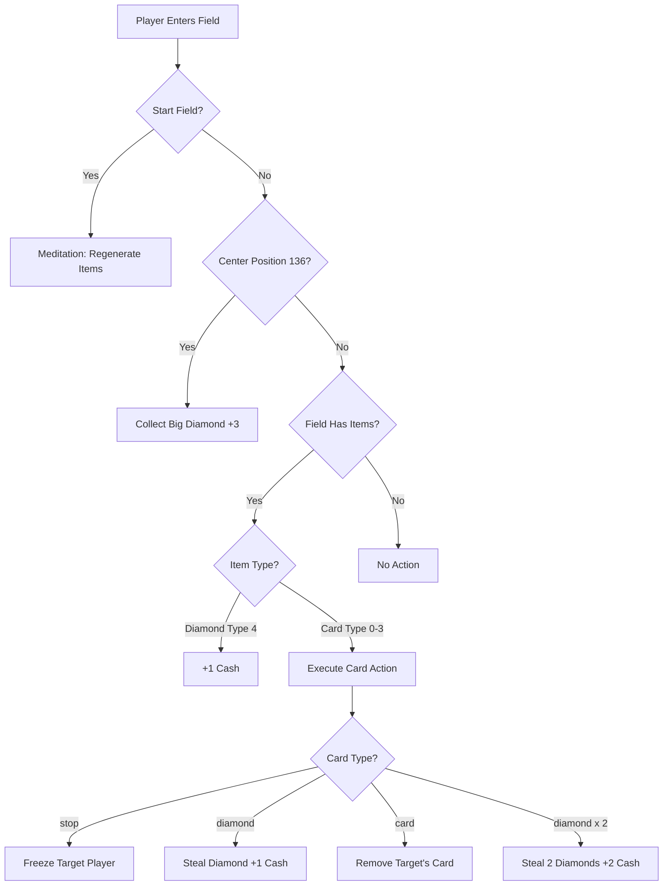
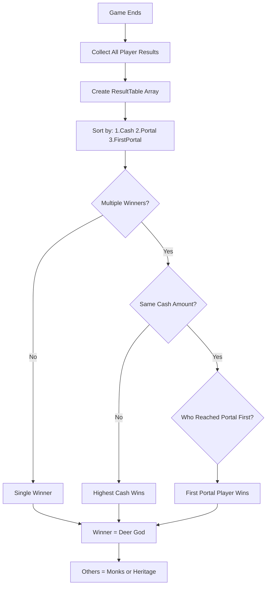
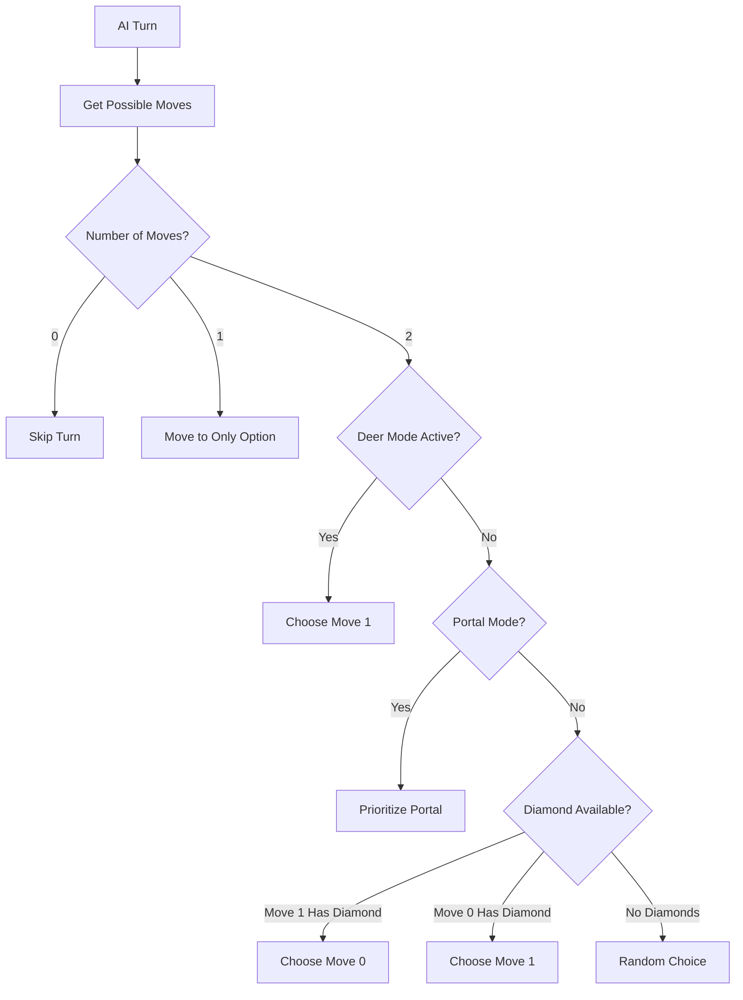
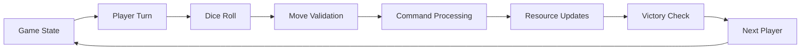

# 🦌 DeerPortal Game Logic Analysis & Implementation

## Overview

DeerPortal is a computer multiplayer board game driven by the four classical elements. This document provides a comprehensive analysis of how the game rules are implemented in the codebase, based on thorough code examination and the official handbook (DeerPortalHandbook.pdf located in assets/pdf/).

## 🎯 Core Game Objective

**Goal**: Transform into a **Deer Lesser God** by reaching the **Hoof Portal** and collecting the most diamonds.

**Victory Conditions**:
1. **Primary**: Player with most diamonds wins
2. **Tiebreaker**: First player to reach portal wins
3. **Transformation**: Winner becomes Deer God, others become monks or heritage

## 🏗️ Game Architecture

### Board Structure
- **Size**: 16×16 grid (256 positions)
- **Tile Size**: 40 pixels each
- **Total Dimensions**: 640×640 pixels
- **Center Position**: (320, 320) - Position 136

```cpp
// Core constants from src/data.h
const static int startPlayers[4] = {0,15,255,240};      // Starting positions
const static int endPlayers[4] = {119,120,135,136};     // Portal exit positions
const static int diamondsNumber = 112;                   // Total diamonds on board
```

### Player System
**Elements & Colors** (from `src/data.cpp`):
- **Water** (Player 0): Blue `sf::Color(122, 185, 246, 255)`
- **Earth** (Player 1): Green `sf::Color(144, 226, 106, 255)`  
- **Fire** (Player 2): Red `sf::Color(255, 163, 142, 255)`
- **Air** (Player 3): Yellow `sf::Color(250, 255, 117, 255)`

### Player Attributes (from `src/playerhud.h`)
Each player has the following complete attribute set:
```cpp
class Player {
    int pos;              // Current board position
    int cash;             // Diamond count (primary victory condition)
    int energy;           // Resource attribute
    int food;             // Resource attribute  
    int faith;            // Resource attribute
    bool active;          // Currently playing
    bool done;            // Reached portal (finished)
    int frozenLeft;       // Turns remaining in freeze state
    bool reachedPortal;   // Has reached any portal exit
    bool reachedPortalFirst; // Was first to reach portal
    bool human;           // Human vs AI controlled
    bool reachPortalMode; // Can access portal (has most diamonds)
};
```

## 🎮 Game Flow


## 🎲 Core Game Mechanics

### 1. Turn System

**Implementation**: `src/game.cpp::launchNextPlayer()`

```cpp
void Game::launchNextPlayer() {
    // Skip finished/frozen players
    if (players[turn].done == true) {
        nextPlayer();
        return;
    }
    
    // Handle frozen players
    if (players[turn].frozenLeft > 0) {
        players[turn].frozenLeft -= 1;
        nextPlayer();
        return;
    }
    
    // Set active player and roll dice
    selector.changeColor(turn);
    diceResultPlayer = 6; // Default value
    currentState = state_roll_dice;
}
```

### 2. Dice System

**Implementation**: `src/rounddice.cpp`

```cpp
int RoundDice::throwDiceSix() {
    int result = (rand() % 6) + 1;
    setDiceTexture(result);
    return result;
}
```

### 3. Movement System

**Implementation**: `src/game.cpp::playerMakeMove()`

Players can move 1-6 spaces based on dice roll. Movement follows predefined paths in the `boards` array.

```cpp
void Game::playerMakeMove(int mousePos) {
    players[turn].setFigurePos(mousePos);
    commandManager.processField(mousePos);  // Handle field effects
    
    // Check for portal exit
    const int *possibleExit = std::find(std::begin(DP::endPlayers),
                                        std::end(DP::endPlayers), mousePos);
    if (possibleExit != DP::endPlayers+4) {
        // Player reached portal
        players[turn].done = true;
        players[turn].reachedPortal = true;
        // ... portal logic
    }
}
```

### 4. Field Processing System

**Implementation**: `src/command.cpp::processField()`



### 5. Resource Management System

**Diamond Distribution** (from `src/boarddiamondseq.h`):
> "We are going to have 2 cards / diamonds of each element per each area, which gives 2*4*4 = 32 cards diamonds of elements on the board. Additionally there will be extra 6 white diamonds per area to collect, which gives 4*6 = 24 diamonds on the board. Together it would give 32 + 24 = 56 diamonds cards/diamonds together, 15 per area."

**Actual Implementation**: 112 total diamonds (28 per player area)

**Resource Types**:
- **Type 4**: Pure diamonds (+1 cash when collected)
- **Type 0-3**: Cards corresponding to elements (trigger special effects)

### 6. Card System

**Card Distribution** (from `src/cardslist.h`):
```cpp
const static std::array<int,32> cardsDistribution = {{
    0,0,0,0,0,0,0,0,  // 8 "stop" cards
    1,1,1,1,1,1,1,1,  // 8 "card" cards  
    2,2,2,2,2,2,2,2,  // 8 "diamond" cards
    3,3,3,3,3,3,3,3,  // 8 "diamond x 2" cards
}};
```

**Card Types** (from `src/card.h`):
```cpp
const static std::array<std::string, 4> cardsTypes = {
    {"stop", "card", "diamond", "diamond x 2"}
};
```

**Card Effects**:
- **"stop"**: Freezes target player for one turn (`frozenLeft += 1`)
- **"card"**: Removes random card from target player's area
- **"diamond"**: Steals one diamond from target player's area (+1 cash)
- **"diamond x 2"**: Steals two diamonds from target player's area (+2 cash)

**Card Logic** (from `src/command.cpp::processCard()`):
```cpp
if (tokenNumber != game.turn) {  // Can't use cards on your own area
    if (cardType == "diamond") {
        removeDiamond(game.boardDiamonds.getNumberForField(pos));
        game.players[game.turn].cash += 1;
    } else if (cardType == "stop") {
        freezePlayer(tokenNumber);
    } else if (cardType == "card") {
        removeCard(game.boardDiamonds.getNumberForField(pos));
    } else if (cardType == "diamond x 2") {
        if (removeDiamond(game.boardDiamonds.getNumberForField(pos)))
            game.players[game.turn].cash += 1;
        if (removeDiamond(game.boardDiamonds.getNumberForField(pos)))
            game.players[game.turn].cash += 1;
    }
}
game.cardsDeck.nextCard(tokenNumber);  // Advance to next card in pile
```

### 7. Big Diamond System (Center Bonus)

**Position**: (320, 320) - Board position 136
**Logic**: `src/command.cpp` + `src/game.cpp`

```cpp
// Hide big diamond when player enters center position
if (pos == 136 && game.bigDiamondActive) {
    game.bigDiamondActive = false;
    game.players[game.turn].cash += 3;  // Bonus for collecting center diamond
}

// Show diamond for player with most diamonds
if (mostDiamonds() == turn) {
    players[turn].reachPortalMode = true;
    bigDiamondActive = true;
} else {
    players[turn].reachPortalMode = false;
    bigDiamondActive = false;
}
```

### 8. Meditation System

**Trigger**: Player returns to starting position with exact dice roll
**Effect**: Regenerates all diamonds and cards on player's board section

```cpp
if ((startField) && (DP::startPlayers[game.turn] == pos)) {
    game.banner.setText("meditation");
    game.boardDiamonds.reorder(game.turn);  // Regenerate resources
    game.sfx.soundMeditation.play();
}
```

### 9. Portal & Deer Mode

**Portal Positions**: `{119, 120, 135, 136}`
**Deer Mode**: 16 turns (4 rounds × 4 players) after first portal entry

```cpp
void Game::startDeerMode() {
    deerModeActive = true;
    deerModeCounter = 16;
    banner.setText("deer mode");
    bigDiamondActive = false;  // Hide center diamond
    sfx.soundDeerMode.play();
}
```

**Portal Entry Logic**:
```cpp
// First player bonus
if (firstPortalReached == false) {
    firstPortalReached = true;
    players[turn].reachedPortalFirst = true;
    players[turn].cash += 5;  // Bonus for first portal entry
    startDeerMode();
}
```

### 10. Freeze System

**Implementation**: Players can be frozen by "stop" cards
```cpp
void Command::freezePlayer(int playerNumber) {
    game.players[playerNumber].frozenLeft += 1;
}
```

**Effect**: Player skips their next turn(s), `frozenLeft` decrements each turn

## 🏆 Victory System

### Winner Calculation

**Implementation**: `src/game.cpp::setTxtEndGameAmount()`



```cpp
struct ResultTable {
    int playerNumber;
    int playerResult;      // Cash amount
    bool reachedPortal;    // Did they reach portal?
    bool reachedPortalFirst; // Were they first to portal?
    
    bool operator < (const ResultTable& other) const {
        if (playerResult != other.playerResult) 
            return (playerResult > other.playerResult); // Higher cash wins
        else if (reachedPortalFirst == true)
            return true; // First to portal wins ties
        return false;
    }
};
```

## 🧠 AI System

### AI Decision Logic

**Implementation**: `src/game.cpp::update()` AI section



**AI Strategy Priorities**:
1. **Portal Access**: If `reachPortalMode == true`, prioritize portal moves
2. **Resource Collection**: Prioritize fields with diamonds/cards
3. **Deer Mode**: During final phase, choose second available move
4. **Random Fallback**: If no strategic advantage, choose randomly

```cpp
if (sizeRndPos == 2) {
    if (deerModeActive) {
        playerMakeMove(listRandomPos[1]);
    } else {
        if (players[turn].reachPortalMode == true) {
            playerMakeMove(listRandomPos[1]); // Prioritize portal
        } else {
            // Prioritize diamond collection
            if (boardDiamonds.ifFieldIsEmpty(listRandomPos[1]) == false) {
                playerMakeMove(listRandomPos[1]);
                return;
            }
            if (boardDiamonds.ifFieldIsEmpty(listRandomPos[0]) == false) {
                playerMakeMove(listRandomPos[0]);
                return;
            }
            // Random if no diamonds
            int randPos = rand() % 2;
            playerMakeMove(listRandomPos[randPos]);
        }
    }
}
```

## 🔧 Technical Implementation

### State Management

**Game States** (from `src/game.h`):
- `state_menu`: Main menu
- `state_setup_players`: Player configuration
- `state_lets_begin`: Game start animation
- `state_roll_dice`: Dice rolling phase
- `state_game`: Active gameplay
- `state_gui_end_round`: Round end display
- `state_end_game`: Victory screen

### Asset Management

**Key Textures**:
- `diamond-big.png`: Center diamond (6.4KB)
- `board_diamonds.png`: Small diamonds (11KB)
- `characters.png`: Player sprites
- `background_land.png`: Main board (1.3MB)

### Audio System

**Sound Effects**:
- `dice.ogg`: Dice roll
- `meditation.ogg`: Meditation action
- `dp-ok.ogg`: Portal entry (`soundPortal`)
- `deermode.ogg`: Deer mode activation

## 📊 Game Balance

### Resource Distribution

**Diamonds**: 112 total across board (28 per player area)
**Cards**: 32 per element type (128 total)
**Turn Limit**: 16 turns in Deer Mode

### Scoring System

- **Regular Diamond**: +1 cash
- **Center Diamond**: +3 cash  
- **Portal Bonus**: +5 cash (first player only)
- **Card Effects**: Varies by type

## 🔄 Seasonal System & Calendar

**Implementation**: `src/data.cpp` + `src/calendar.h`

```cpp
std::string seasonsNames[4] = {"winter", "spring", "summer", "fall"};
```

**Pagan Holiday System**: 59 different pagan holidays throughout the year (from `calendar.h`)
**Logic**: Every 4 months (turns), season advances. Affects visual theme and provides thematic context but not core mechanics.

**Examples of Holidays**:
- Imbolg/Brighid (Feb 2) - 1st Cross-Quarter Day
- Beltane (May 1) - Celtic bonfire festival  
- Summer Solstice (Jun 20) - Litha
- Samhain (Nov 1) - Celtic feast of departing Sun

## 🛠️ Code Architecture Summary

### Key Classes

1. **Game** (`src/game.cpp`): Main game controller and state manager
2. **Command** (`src/command.cpp`): Field action processor and rule enforcer
3. **Player** (`src/playerhud.cpp`): Individual player state and attributes
4. **BoardDiamondSeq** (`src/boarddiamondseq.cpp`): Resource distribution and management
5. **CardsDeck** (`src/cardsdeck.cpp`): Card system and pile management
6. **CardsList** (`src/cardslist.cpp`): Individual card pile handling
7. **Card** (`src/card.cpp`): Individual card properties and effects
8. **RoundDice** (`src/rounddice.cpp`): Dice mechanics and randomization

### Data Structures

- **boards[256][2]**: Movement graph for all positions
- **occupiedFields[4][39]**: Valid positions per player area
- **DIAMONDS_SETUP[112][3]**: Initial diamond placement configuration
- **startPlayers[4]** & **endPlayers[4]**: Start/portal positions
- **cardsDistribution[32]**: Card type distribution in each pile
- **PAGAN_HOLIDAYS[59][3]**: Seasonal calendar system

### Game Loop Architecture



This implementation successfully translates the spiritual and mythological themes of the original DeerPortal concept into a functional, multi-layered strategy game with complex resource management, strategic card play, multiple victory paths, and sophisticated AI opponents. The game balances simplicity in core mechanics (dice + move) with depth in strategic decision-making through the card system, portal race, and resource competition. 